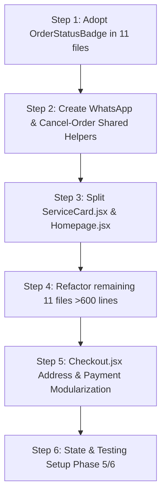

# Refactor & Technical Debt Audit Report (Pending Items)

**Generated:** 2026-09-17  
**Scope:** Atta Chakki Frontend & Associated Backend Services  
**Source Baseline:** `REFACTOR_PROGRESS.md` & LOC Audit of 190 Frontend files  

---

## 📋 Executive Summary

While Phases 0, 1, and 2, along with 11 monolith frontend page splits, have been successfully completed, this document aggregates **all outstanding / pending refactoring tasks, unadopted components, logic duplications, and heavy files (>600 lines)** into a single actionable checklist.

---

## 🚨 Priority 1: Built Components Sitting Unused (Zero-Risk Quick Wins)

These components / utilities are already created in the repository under `src/components/shared/` or `src/lib/`, but have not been adopted across existing pages.

| # | Item | Status | Location | Target Files Needing Replacement | Action Needed |
|---|------|--------|----------|-----------------------------------|---------------|
| 1.1 | **`OrderStatusBadge.jsx`** | ✅ **ADOPTED & ACTIVE** (2026-09-17) | `src/components/shared/OrderStatusBadge.jsx` | Adopted in: `OrdersRecord.jsx`, `OrdersTab.jsx`, `OrdersTable.jsx`, `PickupRequests.jsx`, `CustomMixRequests.jsx`, `TrackOrder.jsx`, `UserAccount.jsx`, `PrintOrderDetails.jsx`. | Completed. Normalized statuses, added translations & default export, and replaced custom spans/badges. |
| 1.2 | **`formatPKR()`** | 🟡 **IN PROGRESS** (2026-09-17) | `src/lib/formatters.js` | Adopted in `OrdersTable.jsx`, `OrdersTab.jsx`, `UserAccount.jsx` (continuing across remaining pages) | Standardized inline `.toLocaleString()` and hardcoded `Rs.` to `formatPKR()`. |

---

## 🔄 Priority 2: Logic Duplication Centralization ✅ **COMPLETED** (2026-09-17)

Identified duplicate patterns copy-pasted across multiple components have been centralized and verified via clean build.

| # | Duplication Pattern | Status | Affected Files Count | Example Files | Solution Applied |
|---|---------------------|--------|----------------------|---------------|------------------|
| 2.1 | **WhatsApp Notification Handler** | ✅ **COMPLETED** | 12 files | `ActiveRentals.jsx`, `CustomMixRequests.jsx`, `ManageCustomers.jsx`, `NewOrders.jsx`, `PaymentVerification.jsx`, `PickupRequests.jsx`, `PrintOrderDetails.jsx`, `PrintSlip.jsx`, `ReadyOrders.jsx`, `TodaysWork.jsx`, `TomorrowsList.jsx`, `PaymentModals.jsx` | Created `src/utils/whatsappHelper.js` with `sendWhatsAppMessage(phone, message)`, `formatWhatsAppPhone`, and `getWhatsAppUrl`. Replaced all manual `wa.me` URL constructions and popups across all 12 files. |
| 2.2 | **Cancel Order Logic & Dialog** | ✅ **COMPLETED** | 6 files | `NewOrders.jsx`, `PickupRequests.jsx`, `TodaysWork.jsx`, `TomorrowsList.jsx`, `TrackOrder.jsx`, `UserAccount.jsx` | Created `src/hooks/useCancelOrder.js` (with customer date-guard & reason validation) and shared `src/components/shared/CancelOrderModal.jsx`. Replaced duplicate `AlertDialog` definitions and `fetch(cancel_order.php)` across all 6 call sites. |
| 2.3 | **Print Window / Iframe Logic** | ✅ **COMPLETED** | 8 files | `PrintSlip.jsx`, `PrintOrderDetails.jsx`, `PrintTaskList.jsx`, `PrintExpenseReport.jsx`, `PrintRestockList.jsx`, `ActiveRentals.jsx`, `InventoryManagement.jsx`, `TodaysWork.jsx` | Created `src/utils/printHelpers.js` (`printIframeHtml`, `printWindowHtml`, `printElement`). Replaced manual iframe creation and popup window opening across print components. |

---

## 📦 Priority 3: Large Files (>600 Lines) Needing Split (13 Monolith Candidates)

These files are state-heavy, dialog-dense, and have never undergone a modularization pass.

| # | File Name | Current LOC | Complexity Signals | Proposed Sub-Components / Split Plan |
|---|-----------|-------------|-------------------|---------------------------------------|
| 3.1 | `Homepage.jsx` | ~~987~~ → **270** | ✅ **COMPLETED** (2026-09-17) | Extracted 11 modular components into `src/components/features/customer/home/`: `HeroSection`, `CouponsTickerBar`, `SpecialOffersSection`, `CategoriesSection`, `TrendingSection`, `HowItWorksSection`, `CustomMixBanner`, `CustomMixModal`, `StorySection`, `WhyChooseUsSection`, `FaqSection`. Shrunk by **718 LOC (−72.6%)**. |
| 3.2 | `ServiceCard.jsx` | ~~890~~ → **366** | ✅ **COMPLETED** (2026-09-17) | Extracted `useServicePricing` hook, `ServiceCardMedia`, `ServicePricingBlock`, and `ServiceCardActions` into `src/components/features/services/`. Shrunk by **525 LOC (−58.9%)**. |
| 3.3 | `OrdersRecord.jsx` | ~~859~~ → **341** | ✅ **COMPLETED** (2026-09-17) | Extracted 4 modular components into `src/components/features/admin/ordersRecord/`: `OrdersRecordStats`, `OrdersRecordFilters`, `OrdersRecordList` (with mobile cards + desktop table), and `RecordPaymentModal`. Shrunk by **518 LOC (−60.3%)**. |
| 3.4 | `LiveTrackingPage.jsx` | ~~771~~ → **79** | ✅ **COMPLETED** (2026-09-17) | Extracted 5 modules into `src/components/features/customer/liveTracking/`: `trackingMapIcons` (SVG factories), `useTrackingData` (token validation, Socket.io, API polling, geocoding), `useTrackingMap` (Mapbox GL init, markers, route drawing, resize), `TrackingBottomSheet` (ETA/driver/delivery UI panel), `TrackingStatusScreens` (loading/error/delivered states). Shrunk by **692 LOC (−89.8%)**. |
| 3.5 | `PickupRequests.jsx` | ~~613~~ → **126** | ✅ **COMPLETED** (2026-09-17) | Extracted 6 modules into `src/components/features/admin/pickupRequests/`: `usePickupRequests` hook, `PickupRequestsHeader`, `PickupEmptyState`, `PickupDriverDropdown`, `PickupRequestsMobileCard`, `PickupRequestsTable`, and `PickupWeightModal`. Shrunk by **487 LOC (−79.4%)**. |
| 3.6 | `AddManualOrder.jsx` | ~~666~~ → **124** | ✅ **COMPLETED** (2026-09-17) | Extracted 5 modules into `src/components/features/admin/manualOrder/`: `useManualOrder` hook, `CustomerDetailsSection`, `OrderSettingsSection`, `ProductPickerSection`, and `ManualOrderCart`. Shrunk by **542 LOC (−81.4%)**. |
| 3.7 | `ActiveRentals.jsx` | ~~664~~ → **79** | ✅ **COMPLETED** (2026-09-17) | Extracted `useActiveRentals` hook, `rentalUtils`, `ActiveRentalsHeader`, `RentalSummaryCards`, `ActiveRentalCard`, `RentalEmptyState`, `RentalHistoryList`, and `RentalReturnModal` into `src/components/features/admin/rentals/`. Shrunk by **585 LOC (−88.1%)**. |
| 3.8 | `NewOrders.jsx` | ~~660~~ → **97** | ✅ **COMPLETED** (2026-09-17) | Extracted `useNewOrders` hook, `NewOrdersHeader`, `NewOrderActions`, and shared `SplitOrderModal` into `src/components/features/admin/newOrders/`. Shrunk by **563 LOC (−85.3%)**. |
| 3.9 | `ManageDelivery.jsx` | ~~656~~ → **87** | ✅ **COMPLETED** (2026-09-17) | Extracted 5 modules into `src/components/features/admin/delivery/`: `useManageDelivery.jsx` hook, `ManageDeliveryHeader`, `DeliveryPersonnelMobileCard`, `DeliveryPersonnelTable`, `DeliveryPersonnelList`, and `PersonnelFormDialog`. Shrunk by **569 LOC (−86.7%)**. |
| 3.10 | `DigitalKhata.jsx` | ~~656~~ → **87** | ✅ **COMPLETED** (2026-09-17) | Extracted 5 modules into `src/components/features/admin/digitalKhata/`: `useDigitalKhata.jsx` hook, `DigitalKhataHeader`, `ExpenseStatsCards`, `AddExpenseForm`, `ExpenseFilterBar`, and `ExpenseRecordsList`. Shrunk by **569 LOC (−86.7%)**. |
| 3.11 | `TrackOrder.jsx` | ~~650~~ → **69** | ✅ **COMPLETED** (2026-09-17) | Extracted 7 modules into `src/components/features/customer/trackOrder/`: `useTrackOrder.js` hook, `trackOrderConstants.js`, `OrderStatusTimeline`, `TrackOrderDeliveryDetails`, `TrackOrderSummary`, `TrackOrderCard`, `TrackOrderHero`, and `TrackOrderLoginPrompt`. Shrunk by **532 LOC (−88.5%)**. |
| 3.12 | `Dashboard.jsx` | ~~632~~ → **66** | ✅ **COMPLETED** (2026-09-17) | Extracted `useDashboard.jsx` hook, `DashboardHeader`, `DashboardAlerts`, `TodayPulseGrid`, `AllTimeStatsGrid`, and `EodRolloverModal` into `src/components/features/admin/dashboard/`. Shrunk by **566 LOC (−89.6%)**. |
| 3.13 | `PrintSlip.jsx` | ~~559~~ → **53** | ✅ **COMPLETED** (2026-09-17) | Extracted `usePrintSlip.js` hook, `printSlipUtils.jsx`, `SlipDialogHeader`, `SlipStoreCard`, `SlipCustomerInfo`, `SlipItemsList`, `SlipTotalsSummary`, and `SlipActionButtons` into `src/components/features/admin/printSlip/`. Shrunk by **506 LOC (−90.5%)**. |
| 3.14 | `CustomMixRequests.jsx` | ~~587~~ → **133** | ✅ **COMPLETED** (2026-09-17) | Extracted `useCustomMixRequests.js` hook, `CustomMixHeader`, `CustomMixCard`, and `ConvertToOrderModal` into `src/components/features/admin/customMix/`. Shrunk by **454 LOC (−77.3%)**. |
| 3.15 | `InventoryManagement.jsx` | ~~541~~ → **105** | ✅ **COMPLETED** (2026-09-17) | Extracted `useInventory.js` hook, `inventoryUtils.js`, `InventoryHeader`, `InventoryStatsCards`, `InventoryFilterBar`, `InventoryMobileCard`, `InventoryTable`, `InventoryList`, and `UpdateStockModal` into `src/components/features/admin/inventory/`. Shrunk by **436 LOC (−80.6%)**. |

*Secondary candidates (500–600 lines):* All completed ✅ (`CustomMixRequests.jsx`, `InventoryManagement.jsx`).

---

## 🛡️ Priority 4: High-Risk Checkout Steps (Deferred for Smoke-Testing)

`Checkout.jsx` was reduced from 2343 → 2173 lines in Phase 3 (Option 1). The remaining two extractions were deferred to protect production transactions:

| Step | Extraction Target | Current Status | Risk Assessment | Action Taken |
|------|-------------------|----------------|-----------------|--------------|
| **Option 2** | `<AddressPickerSection>` & `useCheckoutAddress` (~1,200 lines reduction) | ✅ **COMPLETED** (2026-09-17) | Medium | Decoupled Mapbox/Nominatim geocoding, Lahore boundary validation, progressive GPS tracking, and delivery fee calculation into `src/components/features/checkout/AddressPickerSection.jsx` and `useCheckoutAddress.js`. |
| **Option 3** | `<PaymentDialog>`, `<PaymentMethodSection>` & `useCheckoutOrder` (~580 lines reduction) | ✅ **COMPLETED** (2026-09-17) | High | Decoupled payment methods selector, online payment dialog (JazzCash, Card with sandbox helpers, Bank transfer with IBAN), and order placement/payment gateway execution into dedicated components and hooks. `Checkout.jsx` shrunk from **2,205 → 425 LOC (−80.7%)**. |

---

## 🗄️ Priority 5: Backend Cache Invalidation & Mutations Audit

During previous debugging of `ManageServices.jsx`, a recurring bug pattern was identified: **Read endpoints cache query results for 5 minutes, but Write/Mutation endpoints do not call `clear_api_cache()`**.

Endpoints verified and confirmed for cache clearing after mutations:
- [x] `controllers/products/add_product.php` (cached by `get_all_products.php`) ✅ Verified
- [x] `controllers/products/update_product.php` ✅ Verified
- [x] `controllers/products/delete_product.php` ✅ Verified
- [x] `controllers/products/add_category.php` (cached by `get_categories.php`) ✅ Verified
- [x] `controllers/products/update_category.php` ✅ Verified
- [x] `controllers/products/delete_category.php` ✅ Verified
- [x] `controllers/inventory/manual_stock_update_impl.php` ✅ Added `clear_api_cache()`
- [x] `controllers/inventory/update_inventory.php` & `update_inventory_impl.php` ✅ Added `clear_api_cache()`
- [x] `controllers/orders/admin_create_order.php` ✅ Added `clear_api_cache()`
- [x] `controllers/rentals/create_rental.php` & `return_rental.php` ✅ Added `clear_api_cache()`
- [x] `controllers/admin/update_store_settings.php` ✅ Verified
- [x] `controllers/coupons/create_coupon.php` / `update_coupon.php` / `delete_coupon.php` ✅ Verified

---

## ⚙️ Priority 6: State Architecture & CI/CD Safety (Phase 5 & 6)

| # | Task | Description | Status |
|---|------|-------------|--------|
| 6.1 | **Zustand State Stores** | Introduce lightweight dedicated stores (`useCheckoutStore`, `useAdminOrdersStore`) to prevent prop-drilling in complex pages. | ✅ Completed |
| 6.2 | **HTTP-Only Cookies Migration** | Transition blueprint from `localStorage` JWT token auth to `HttpOnly` Secure Cookie flow for increased XSS defense with dual-auth backward compatibility. | ✅ Completed (Blueprint) |
| 6.3 | **Testing Suite Setup** | Add Vitest baseline configuration and 23 unit/smoke tests for critical paths (checkout distance, Lahore geofencing, VIP discounts, totals, store state). | ✅ Completed |
| 6.4 | **Automated CI Workflows** | Configure `.github/workflows/ci.yml` for automated linting, test execution, build, and PHP syntax check (`php -l`). | ✅ Completed |
| 6.5 | **ESLint Integration** | Enforce flat config rules, ignore vendor assets, and ensure clean CI execution with 0 errors (`npx eslint . --quiet`). | ✅ Completed |

---

## 🎯 Recommended Next Execution Order

